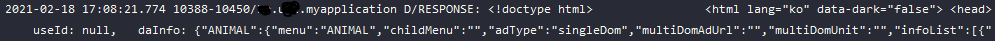

Java에서 kotlin으로 넘어가고 있다.
http connection을 위해 자주 사용하는 것 중 하나인 okhttp3 사용예제를 만들어보자.

>okhttp3가 어떤 라이브러리인지 궁금하면 아래 링크로 들어가자
>[okhttp3 깃허브 링크](https://square.github.io/okhttp/)

#### 1. 라이브러리 추가

app수준의 Gradle에 들어가서 라이브러리를 추가해준다.

~~~gradle
implementation 'com.squareup.okhttp3:okhttp:4.9.0' //포스팅 당시 4.9.0 버전 기준
~~~

 

#### 2. permission 추가

Manifest에 들어가서 INTERNET사용을 위한 permission을 application 태그 밖에 작성해준다.

~~~xml
<uses-permission nadroid:name="android.permission.INTERNET" />
~~~

 

#### 3. okhttp 선언 후 정보 불러오기

okhttp3를 사용한다면 android일 것이고 디자인 패턴에 따라서 알아서 입맛에 맞게 작성하면된다.
지금은 포스팅을 하는 것이니까 간단하게 MainActivity.kt에다가 넣어서 실행하는 것이다.

~~~kotlin
class MainActivity : AppCompatActivity() {
    override fun onCreate(savedInstanceState: Bundle?) {
        super.onCreate(savedInstanceState)
        setContentView(R.layout.activity_main)
        setGetFun()
    }

    private fun setGetFun() {
        val url = "https://www.naver.com"
        val okHttpClient = OkHttpClient();
        val request = Request.Builder().url(url).build()

        okHttpClient.newCall(request).enqueue(object : Callback {
            override fun onFailure(call: Call, e: IOException) {}

            override fun onResponse(call: Call, response: Response) {
                Log.d("RESPONSE", response.body!!.string())
            }
        })
    }
}
~~~

그리고 아래 로그와 같이 통신이 된걸 확인할 수 있다.

